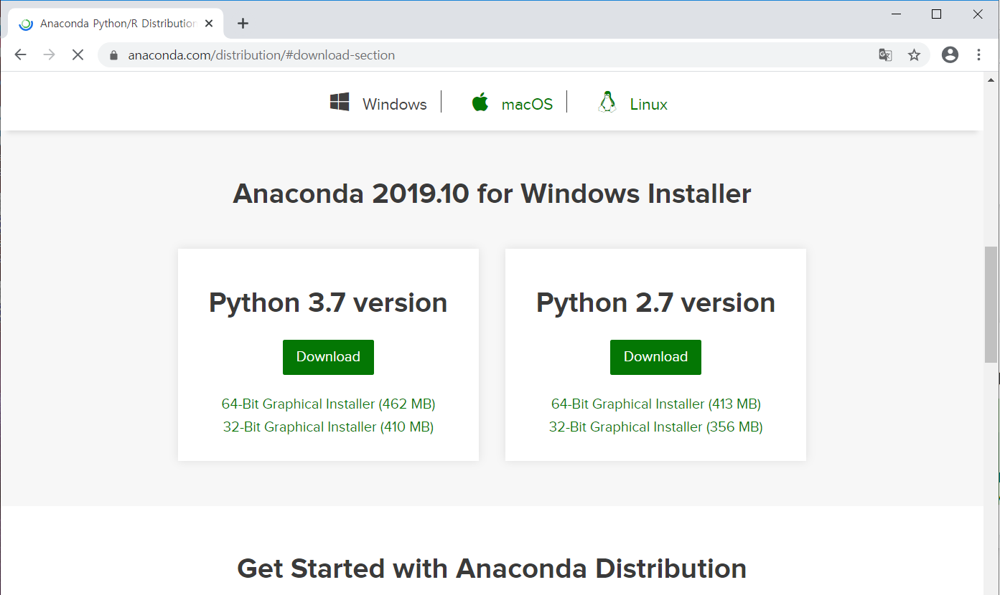
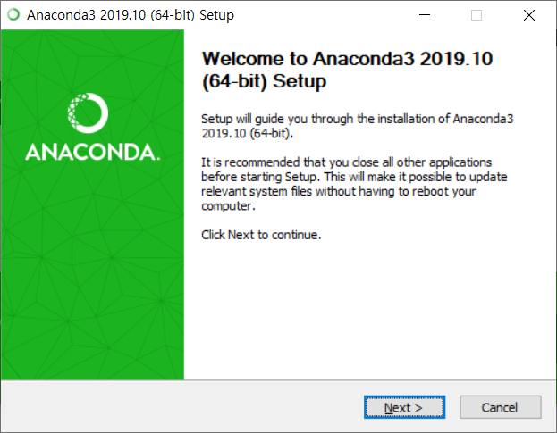
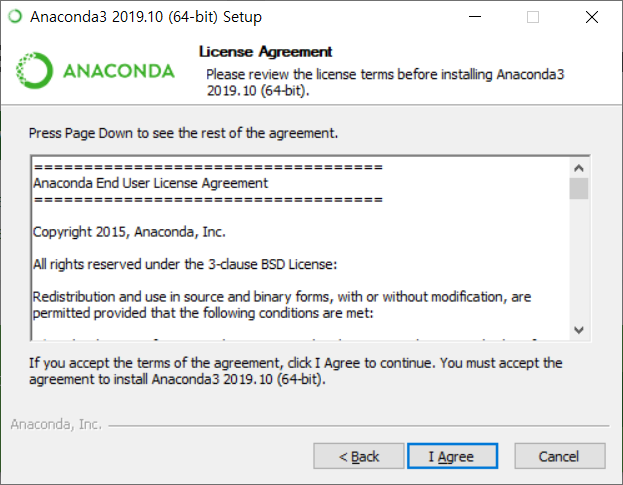

# Python 개발 환경 구축 가이드

### 목차

1. [아나콘다 설치](#아나콘다-설치)
2. [파이참 설치](#2.-파이참-설치)
3. 아나콘다 환경 설정
   1. 아나콘다 프롬프트 실행
   2. 파이썬 환경 생성
   3. 파이썬 환경 접속
   4. 파이썬 패키지 설치
   5. 파이썬 환경 삭제
4. 파이참 환경 설정
   1. 파이참 프로젝트 생성
   2. 파이참 소스파일 생성 및 실행
   3. 파이참 인터프리터 변경

# 아나콘다 설치

- 아래 링크에서 자신의 운영체제에 맞는 Python 3.7 버전 아나콘다 설치파일 다운로드

  https://www.anaconda.com/distribution/#download-section

  

  

- 설치파일 실행

  

  

- I Agree 클릭

  

- 

# 2. 파이참 설치

- 아래 링크에서 자신의 운영체제에 맞는 Community 버전 파이참 설치파일 다운로드 후 실행

  https://www.jetbrains.com/pycharm/download/

- 

# 3. 아나콘다 환경 설정

## 3-1. 아나콘다 프롬프트 실행

##### 윈도우 환경

- 시작메뉴 - Anaconda3 -  

## 3-2. 파이썬 환경 생성

## 3-3. 파이썬 환경 접속

## 3-4. 파이썬 패키지 설치

## 3-5. 파이썬 환경 삭제

# 4. 파이참 환경 설정

## 4.1 파이참 프로젝트 생성

## 4.2 파이참 소스파일 생성 및 실행

## 4.3 파이참 인터프리터 변경

