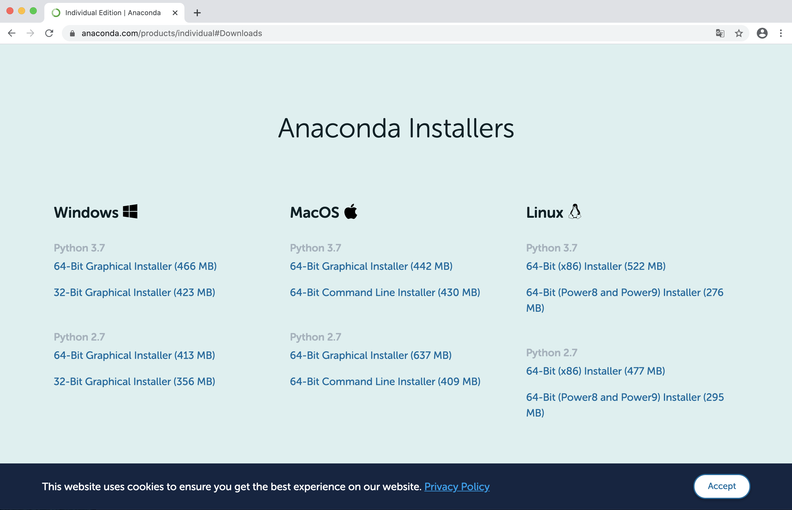

# 파이썬 개발 환경 구축 가이드

# 목차

1. [아나콘다 설치](#아나콘다-설치)
2. [파이참 설치](#파이참-설치)
3. [아나콘다 환경 설정](#아나콘다-환경-설정)
4. [파이참 환경 설정](#파이참-환경-설정)
5. [파이참 아나콘다 환경 연동](#파이참-아나콘다-환경-연동)
6. [아나콘다 환경에 라이브러리 설치](#아나콘다-환경에-라이브러리-설치)


# 아나콘다 설치

[목차로 돌아가기](#목차)

1. 아래 링크에서 자신의 운영체제에 맞는 Python 3.7 버전 아나콘다 설치파일 다운로드 후 실행

   https://www.anaconda.com/distribution/#download-section

   

   

2. Next 클릭

   

   

3. I Agree 클릭

   

  

4. Just Me (recommended) 선택 후 Next 클릭

   


5. Next 클릭 (만약 설치 경로를 바꾸고 싶다면 바꾼 후 Next 클릭)

   

  

6. 두 번째 옵션만 체크하고 Install 클릭

   

  

7. 설치

   

  

8. Next 클릭

   

  

9. Next 클릭

   


10. 두 옵션 모두 체크 해제 후 Finish 클릭

   


[목차로 돌아가기](#목차)


# 파이참 설치

[목차로 돌아가기](#목차)

1. 아래 링크에서 자신의 운영체제에 맞는 Community 버전 파이참 설치파일 다운로드 후 실행

   https://www.jetbrains.com/pycharm/download/

   

  

2. Next 클릭

   

  

3. Next 클릭 (만약 설치 경로를 바꾸고 싶다면 바꾼 후 Next 클릭)

   

  

4. 전부 체크 해제 후 Next 클릭

   

  

5. Install 클릭

   

  

6. 설치

   

  

7. Finish 클릭

   


[목차로 돌아가기](#목차)


# 아나콘다 환경 설정

[목차로 돌아가기](#목차)

1. 시작메뉴 → Anaconda3 (64-bit) → Anaconda Prompt (Anaconda3) 실행

   

  

2. Anaconda3 Prompt 실행화면

   


3. Python 환경 생성(아래 명령어 실행)

   ```
   (base) > conda create -n python-env python=3.6
   ```

   

  

4. y 입력 후 엔터

   

  

5. 생성된 환경 목록 확인(아래 명령어 실행)

    ```
     (base) > conda env list
    ```

   

   목록에 python-env가 보이면 완료

[목차로 돌아가기](#목차)


# 파이참 환경 설정

[목차로 돌아가기](#목차)

1. 파이참 실행

  초기 실행시 테마 선택화면에서 테마 선택 후 Skip 버튼 클릭

  


2. Create New Project 클릭

  

  

3. Create 클릭

   

   

4. 프로젝트 폴더 우클릭 - New - Python File 클릭 후 파일이름 써서 생성

   

   

5. 아래 코드 작성 후 ctrl + shift + f10 키 눌러서 실행

   ```
   print('hello python')
   ```

   

   hello python 이 잘 나오면 완료


[목차로 돌아가기](#목차)


# 파이참 아나콘다 환경 연동

[목차로 돌아가기](#목차)

1. 시작메뉴 → Anaconda3 (64-bit) → Anaconda Prompt (Anaconda3) 실행

   


2. 생성된 환경 목록 확인(아래 명령어 실행) 후 연동할 아나콘다 환경 경로 확인

    ```
     (base) > conda env list
    ```

   

   연동할 아나콘다 환경 옆에 경로 복사


3. 파이참 실행

   


4. 상단 File 메뉴 → Settings 열기

   


5. Project: (프로젝트명) → Project Interpreter 열기

   


6. 상단에 톱니바퀴 → Show All

   


7. 오른쪽 +버튼 누르기(목록에 이미 원하는 환경이 있으면 7 ~ 9 생략)

   


8. Existing environment(2번째) 선택 후 오른쪽 끝에 보이는 ... 버튼 누르기

   


9. 2번 과정에서 복사한 경로 붙여넣고 그 폴더안에 있는 python.exe 선택 후 OK버튼 누르기

   


10. 열려있는 2개 창 모두 OK버튼으로 닫기

   


[목차로 돌아가기](#목차)


# 아나콘다 환경에 라이브러리 설치

[목차로 돌아가기](#목차)

1. 시작메뉴 → Anaconda3 (64-bit) → Anaconda Prompt (Anaconda3) 실행

   


2. 생성된 환경 목록 확인(아래 명령어 실행) 후 연동할 아나콘다 환경 이름 확인

    ```
     (base) > conda env list
    ```

   

   python-env로 튜토리얼 진행


3. 아나콘다 환경 활성화(아래 명령어 실행)

    ```
     (base) > conda activate python-env
    ```

   

   명령줄 맨 앞이 (python-env)로 바뀌었으면 완료


4. 원하는 라이브러리 설치 명령어 실행


5. 아나콘다 환경 비활성화(아래 명령어 실행)

    ```
     (base) > conda deactivate
    ```

   

   명령줄 맨 앞이 (base)로 바뀌었으면 완료


[목차로 돌아가기](#목차)