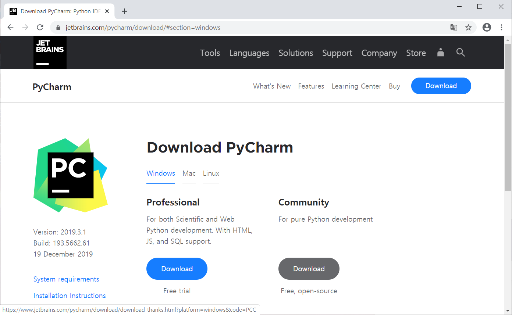

# 파이썬 개발 환경 구축 가이드

### 목차

1. [아나콘다 설치](#아나콘다-설치)
2. [파이참 설치](#파이참-설치)
3. [아나콘다 환경 설정](#아나콘다-환경-설정)
4. [파이참 환경 설정](#파이참-환경-설정)
   1. 파이참 프로젝트 생성
   2. 파이참 소스파일 생성 및 실행
   3. 파이참 인터프리터 변경


# 아나콘다 설치

- 아래 링크에서 자신의 운영체제에 맞는 Python 3.7 버전 아나콘다 설치파일 다운로드 후 실행

  https://www.anaconda.com/distribution/#download-section

  

  

- Next 클릭

  

  

- I Agree 클릭

  

  

- Just Me (recommended) 선택 후 Next 클릭

  


- Next 클릭 (만약 설치 경로를 바꾸고 싶다면 바꾼 후 Next 클릭)

  

  

- 두 번째 옵션만 체크하고 Install 클릭

  

  

- 설치

  

  

- Next 클릭

  

  

- Next 클릭

  


- 두 옵션 모두 체크 해제 후 Finish 클릭

  


# 파이참 설치

- 아래 링크에서 자신의 운영체제에 맞는 Community 버전 파이참 설치파일 다운로드 후 실행

  https://www.jetbrains.com/pycharm/download/

  

  

- Next 클릭

  

  

- Next 클릭 (만약 설치 경로를 바꾸고 싶다면 바꾼 후 Next 클릭)

  

  

- 전부 체크 해제 후 Next 클릭

  

  

- Install 클릭

  

  

- 설치

  

  

- Finish 클릭

  


# 아나콘다 환경 설정

- 시작메뉴 - Anaconda3 (64-bit) - Anaconda Prompt (Anaconda3)

  

  

- Anaconda3 Prompt 실행화면

  


- Python 환경 생성(아래 명령어 실행)

  ```
  (base) > conda create -n python-env python=3.6
  ```

  

  

- y 입력 후 엔터

  

  

- 생성된 환경 목록 확인(아래 명령어 실행)

   ```
  (base) > conda env list
   ```

  

  목록에 python-env가 보이면 정상


# 파이참 환경 설정

- 